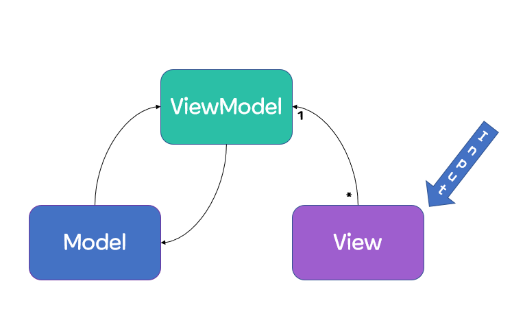
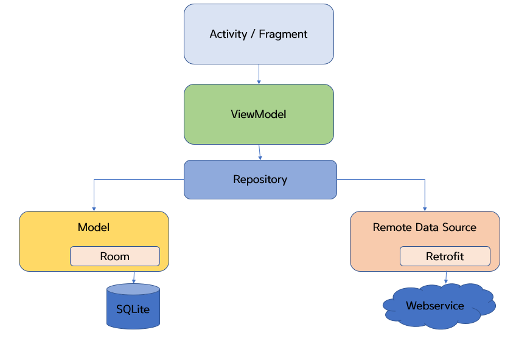

#### 글을 시작하기에 앞서서

소프트웨어를 개발하는데 있어서, 아키텍처와 디자인패턴은 중요한 부분이라고 할 수 있다.

디자인패턴에서 *Repository* 가 쓰여야 하는가? 라는 논점에 대해 논하기에 앞서서 "**디자인 패턴**이 무엇인가? " 와 "왜 소프트웨어 개발을 할 때 디자인패턴을 사용해야하는가?"에 대해서 알아볼 필요가 있다.

#### 디자인패턴은 무엇인가?

##### 디자인패턴이란?

소프트웨어 공학론에서 나온 디자인패턴은 소프트웨어 개발을 하는 도중에 자주 발생하는 문제들을 해결하기 위한 방법론 중 하나이다.

디자인패턴은 아키텍처 설계에서 **반복해서 나오는 문제**들을 **패턴화**하여  또 발생하였을 때 **재사용**과 **재사용가능성**을 용이하게 할 수 있다.

다시말해, 디자인패턴은 재이용이 용이하도록 문제 해결 방식에 이름을 붙여서 정리해둔 방법이다.

##### 디자인패턴의 장단점

* 디자인패턴 장점

1. 재사용이 가능하여 개발 시간 단축
2. 공통의 아키텍처를 공유하여 수월한 의사소통
3. 비즈니스 로직만 이해해도 소프트웨어 구조 파악이 가능해, 용이한 유지보수

* 디자인패턴 단점

1. 초기 시간 비용
2. 객체 지향 위주 설계 및 구현

#### 대표적인 디자인패턴 3형재! MVC, MVP, MVVM

디자인패턴에 대한 개념을 알아봤으니, 디자인패턴을 분석해볼필요가 있다.

디자인패턴에는 여러 종류가 있지만, 이 글에서는 모바일에서 대표적으로 쓰이고 있는 3가지 디자인 패턴을 다룬다.

MVC MVP MVVM, 각 디자인 패턴들이 어떻게 다르고, 서로 어떠한 장단점이 있는지에 대해서 살펴보자.

##### MVC

* MVC 구성

**Model**

앱에서 사용되는 데이터와, 데이터를 처리하는 부분

**View**

사용자에게 보여지는 UI

**Controller**

Model에 통해 가져온 데이터를 View에 전달

* MVC 작동방식

사용자 인터페이스를 시스템의 다른 부분과 분리하기 위한 스타일이다.

사용자가 Controller을 동작시키면 Controller은 Model을 통해 데이터를 가져오고, 그 데이터를 바탕으로 View를 통해서

사용자에게 보여주게 된다.

* MVC 장점

1. 개발자와 디자이너 사이의 협업과 의사소통에 좋다.
2. 각각 역할로 패턴을 구분하였기에 유연성과 확장성이 좋다.
3. 유지보수가 용이하다.

* MVC 단점

1. View와 Controller는 1 대 多 관계이기 때문에, 규모가 커질수록 Controller크기가 매우 커진다.
2. Model과 View 사이의 의존성이 높아, 클래스들이 많아 질수록 구조가 복잡해져 설계 시간이 오래걸린다.

##### MVP

* MVP 구성

**Model**

앱에서 사용되는 데이터와, 데이터를 처리하는 부분

**View**

사용자에게 보여지는 UI

**Presenter**

Presenter는 View에서 요청한 정보로 Model을 가공해 View에게 전달해주는 역할

* MVP 작동방식

MVC와 Model View는 같으나, Controller대신 Presenter가 존재한다.

MVC와 동일한 모델을 가지나, 유저 입력을 View에서 받는다는 차이가 있고, View에서 받은 데이터는 Presenter를 통해 전달되어 Model과 상호작용한다. 이때, View와 Presenter 사이의 관계는 1 대 1 관계이다.

* MVP 장점

1. View와 Model 관계를 분리시켜 Presenter를 통해 상호작용 시켜 Model과 View 사이의 의존성을 해결하였다.

* MVP 단점

1. 역으로 View와 Presenter 사이의 의존성이 높아져 복잡해질수록 의존성이 강해지는 단점이 생기게 되었다.

##### MVVM

* MVVM 구성

**Model**

앱에서 사용되는 데이터와, 데이터를 처리하는 부분

**View**

사용자에게 보여지는 UI

**ViewModel**

View를 위한 Model

* MVVM 작동방식

MVC와 MVP와 마찬가지로 Model과 View는 동일하다. 그대신 Controller나 Presenter대신에 ViewModel이 존재한다. ViewModel은 이름 그래도 View를 나타내주기위해 사용되는 Model인데, ViewModel은 View만을 위한 데이터를 가지고 있어 View와 Model사이의 관계를 분리시킨다. 이때, View와 ViewModel 사이의 관계는 1 대 多 관계이다.

* MVVM 장점

1. View와 Model사이의 관계를 분리시켜, MVC의 의존성 문제를 해결하였다.
2. DataBinding과 Command를 이용하여 View와 View Model사이의 의존성을 해결하였다
3. 각 부분이 독립적이기에 모듈화가 가능하고 유닛테스트가 용이하다.

* MVVM 단점

1. ViewModel의 설계가 어렵다.

##### 무엇을 사용하는 것이 좋은가?

"3가지 대표적인 디자인패턴중에 어떤 것이 가장 좋나요? ""라고 물어본 답에는 답을 하기 어려운데, 그 이유는 각 패턴마다 서로 각각의 장단점이 존재하기 때문이다.

MVC에서 파생된 MVP나 의존성 문제가 해결된  MVVM이 가장 좋아보이고, 더 좋은 아키텍처 설계방법이라고 생각이 들 수 있지만 개발하려는 앱과 개발 환경에 따라서 어떤 패턴이 가장 효율적인 개발론인지는 설계를 하면서 구상을 해야한다.

View와 Controller를 분리할 수 없는 Android의 경우 MVP와 MVVM을 선호하는 추세이다.

#### Repository 패턴이란?

디자인패턴에 대해서 알아보았으니 Repository 패턴에 대해서 알아보자.

##### Repository란?

Repository패턴은 디자인 패턴중 하나로써 ViewModel 아래에 Repository Layer를 두는데, 데이터가 저장되어 있는 저장소를 추상화하여 저장소와 데이터를 사용하는 로직을 분리시키기 위해 사용한다.

##### Repository 작동방식

ViewModel에서 필요한 데이터를 Repository에 요청하면, Repository는 Local Model이나 Remote Data Source에서 데이터를 가져와준다.

##### Repository패턴의 장점

1. 데이터 로직을 비즈니스 로직과 분리할 수 있다.
ViewModel과 Repository가 서로 합쳐져있는 것 보다 분리되어 있으면, Repository가 데이터를 처리해주기에 ViewModel은 어디서 가져온 데이터인지 신경쓰지 않아도 되어 자신의 비즈니스 로직에만 집중할 수 있다.

2. 단위 테스트를 통해서 검증이 가능하다.
3. ViewModel간의 Repository가 공유가 가능하기 때문에 데이터의 일관성을 유지할 수 있다.
4. 모듈화를 할 수 있고, 유지보수성이 용이하다.

##### Repository패턴의 단점

추상 Layer를 하나 더 추가하는 것이기에, 그만큼 관리해야할 코드와 문서 파일들이 많다.

#### Repository는 쓰여야 하는가

DataSource가 변경되더라도 Repository만 변경되는 것이기에 다른 Layer에 영향을 미치지 않고, ViewModel은  데이터가 로컬에서 온 것인지 혹은 서버에서 온 것인지 확인할 필요가 없이 오직 자신의 비즈니스 로직에만 집중할 수 있기에 효율적이다고 할 수 있다.

따라서 **"Repository는 데이터로직과 비즈니스 로직을 분리할 수 있어서 사용하는 것이 좋다."**

#### 글을 마무리하면서

안드로이드 앱 개발을 하면서 아키텍처 설계와 디자인 패턴은 중요하게 작용한다. 소프트웨어의 전반적인 흐름 뿐만 아니라 유지보수와 품질, 테스트 등 소프트웨어 개발에 있어서 중요한 영향을 미치기 때문이다.

단순한 용도가 아닌 장기적인 관점에서 기능 추가와 유지보수를 생각한다면, 디자인 패턴의 공부는 매우 중요한 부분이다. 앱 개발을 시작하거나, 개발을 해봤지만 숙련도가 필요한 사람들에게 디자인 패턴에 대해 공부하는 것을 권장드리며, 더 나아가 CleanArchitecture에 대해서도 논해보는 것이 좋을 것 같다.
